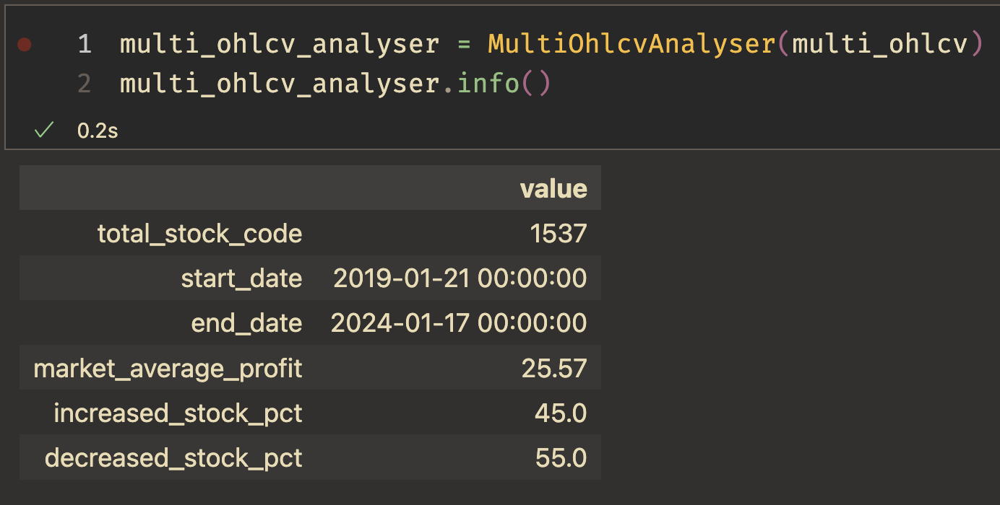
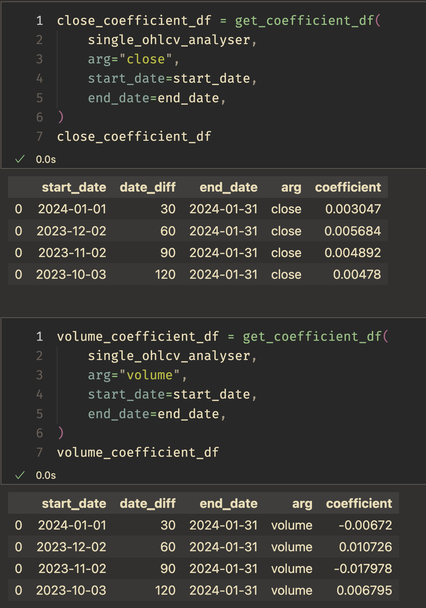
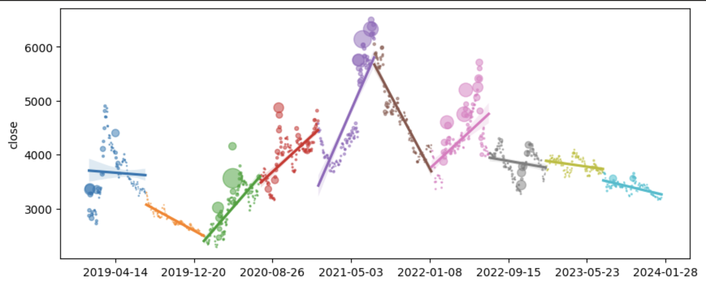
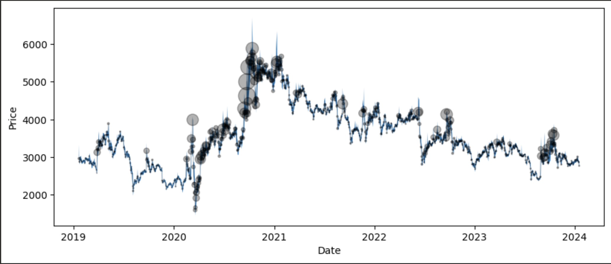

# OhlcvAnalyser

## What OhlcvAnalyser Do?
OhlcvAnalyser helps analyse OHLCV(Open, High, Low, Close, Volume) data.

## How to use OhlcvAnalyser

```
pip install OhlcvAnalyser
```

```python
from OhlcvAnalyser import MultiOhlcvAnalyser, SingleOhlcvAnaylser

from OhlcvAnalyser.analyser import (
    PriceAnalyser,
    ProfitAnalyser,
    VarianceAnalyser,
    CoefficientAnalyser,
)

from OhlcvAnalyser.plotter import Plotter
```

## Examples

### Info


### Price analysis


### Coefficient analysis


### RegressionPlot


### OhlcvPlot
